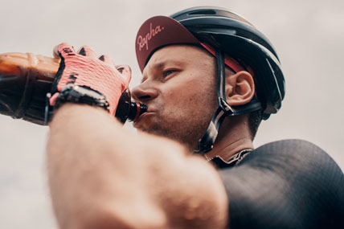

# QU3NCH! beverage 
Athlete-turned-entrepreneur Sarah Smith created QU3NCH!, a unique beverage packed with electrolytes and vitamins for optimal hydration. Unlike sugary sports drinks, QU3NCH! offers delicious flavors (lemon, berry, orange) and eco-friendly packaging, appealing to athletes and health-conscious consumers alike. With its focus on performance, wellness, and sustainability, QU3NCH! is taking the beverage industry by storm.

## Installation
There is no installation process required. Simply download the files to your computer.

## Usage
Open index.html in your browser of choice.

## Contributing
1. Fork it!
2. Create your feature branch: `git checkout -b my-new-feature`
3. Commit your changes: `git commit -am 'Add some feature'`
4. Push to the branch: `git push origin my-new-feature`
5. Submit a pull request :D

## History
TODO: Write history

## Credits
Carlos Cano

## License
MIT - See included license file.